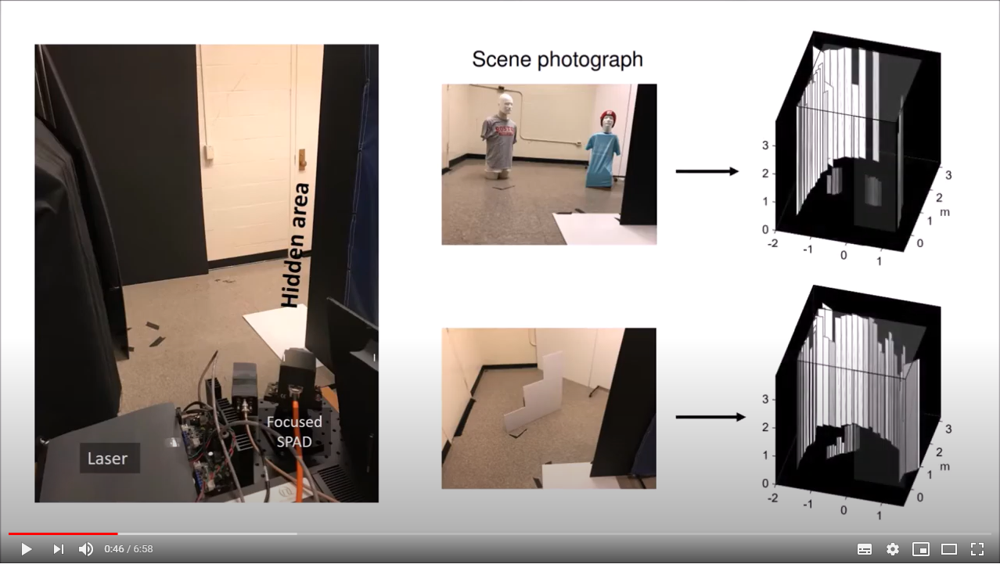

## SkellaPoP algorithm (MATLAB)

**Paper title:** 
Seeing Around Corners with Edge-Resolved Transient Imaging

**Authors:**
J. Rapp, C. Saunders, J. Tachella, J. Murray-Bruce, Y. Altmann, J-Y. Tourneret, S. McLaughlin, R. Dawson, F. Wong and V. K. Goyal

**Published in:**
Nature Communications

**Link to pdf:**
https://www.nature.com/articles/s41467-020-19727-4

## Short introductory video 

## How to run this demo
1. Download the files in this repository
2. Check minimal requirements (below)
3. Run run_example.m. The 2.5D reconstruction should appear at the end of the script.
5. The reconstruction is saved in the folder /results

## Changing the dataset
You can find simple instructions in run_example.m to change the dataset.

## Requirements
MATLAB 2019b (other releases have not been tested)

## Tuning the hyperparameters
Change the following variables in the get_hyperparam.m script.
